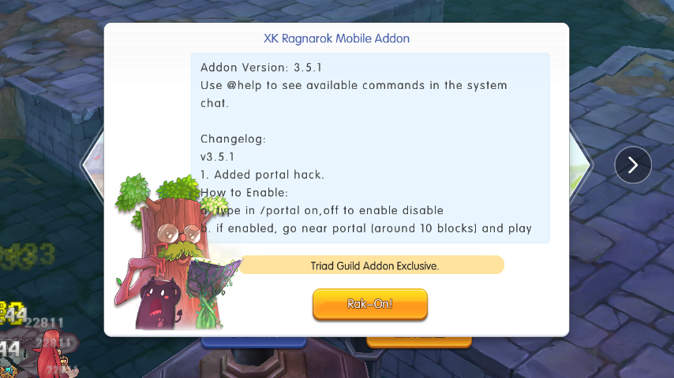

## Exclusive Addon for Triad

### Disclaimer
This addon is free of use. Please do not distribute this addon to non-guild members as it may draw attention. While every care has been taken in preparation of this Addon, I accepts no liability for any loss or damage either direct or consequential. _**Use it at your OWN RISK**_.

### How to Install:
1. Download the login.unity3d included in this link. [login.unity3d](https://drive.google.com/file/d/1JkYEFH002wjdMZqI0kRsi11wjHrXnMUo/view?usp=sharing)
2. Download and Open FX File Explorer (Recommended) or if you have built-in file explorer you can use it.
3. Now browse to this location.
```
Internal Storage > Android > data > com.xd.ro.roapk > files > Android > resources > script
```
4. Paste the downloaded login.unity3d into that folder and overwrite if needed. (You may backup the original login.unity3d incase you want to revert back.)
5. Login in game and see if the popup message show and you are good to go!


### Activated Guilds
1. Triad
2. Triad²

* * *
### How to use the Addon?
You can type in the chat box using **/help** to see all the available commands.

### Main Features


### Available Commands in Game


[Back to Site](./)
